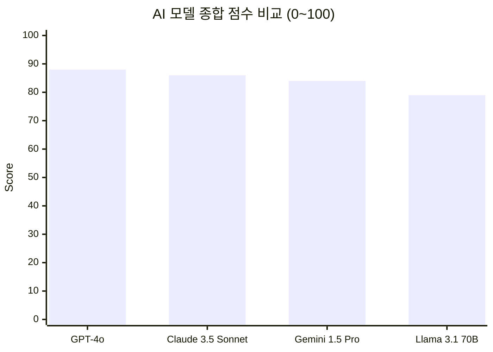
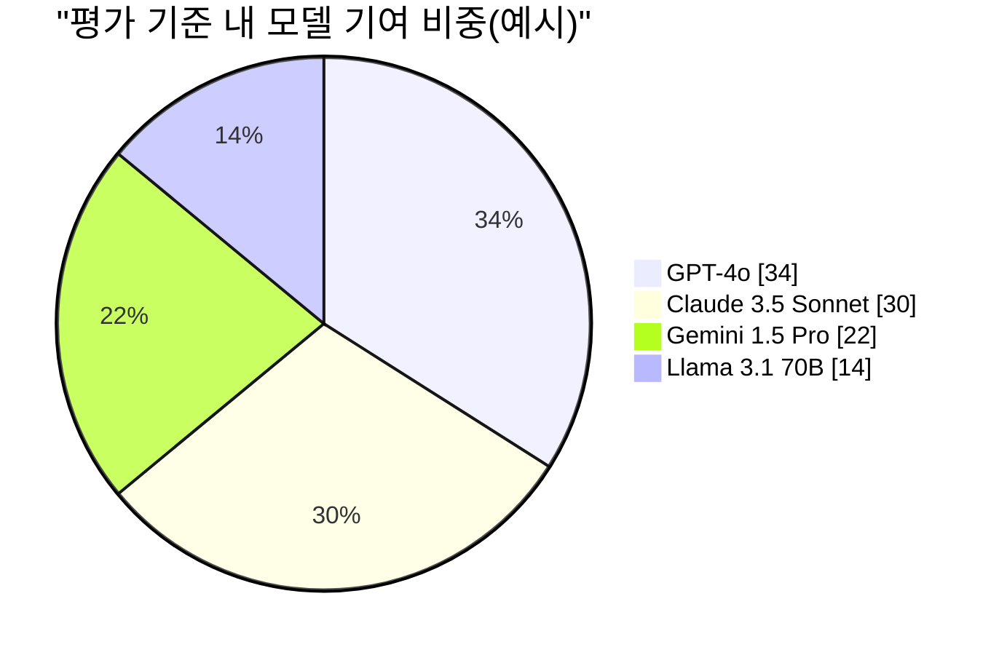

# AI 성능 비교 그래프

아래 예시는 주요 AI 모델의 성능을 한눈에 비교하기 위한 샘플 그래프입니다.  
수치는 설명용 예시 데이터이며, 필요 시 실제 측정값으로 교체해서 사용하면 됩니다.

## 1) 모델별 종합 점수 비교



## 2) 모델별 점유 비중 예시



## 3) 지표 상세 표 (Mermaid 미지원 환경용)

| 모델 | MMLU | HumanEval | MATH | 평균 |
|---|---:|---:|---:|---:|
| GPT-4o | 89 | 90 | 85 | 88.0 |
| Claude 3.5 Sonnet | 88 | 88 | 82 | 86.0 |
| Gemini 1.5 Pro | 86 | 84 | 82 | 84.0 |
| Llama 3.1 70B | 80 | 78 | 79 | 79.0 |

## 4) 업데이트 가이드

1. 평가 지표를 고정합니다. (예: MMLU, HumanEval, MATH)
2. 동일한 조건에서 측정한 최신 수치로 `bar`, `pie`, 표 데이터를 함께 갱신합니다.
3. 변경 이력을 남기기 위해 아래 형식으로 기록합니다.

```
업데이트 날짜: YYYY-MM-DD
데이터 출처: 내부 벤치마크 / 공개 리더보드
비고: 측정 환경(하드웨어, 프롬프트, 샘플 수)
```
